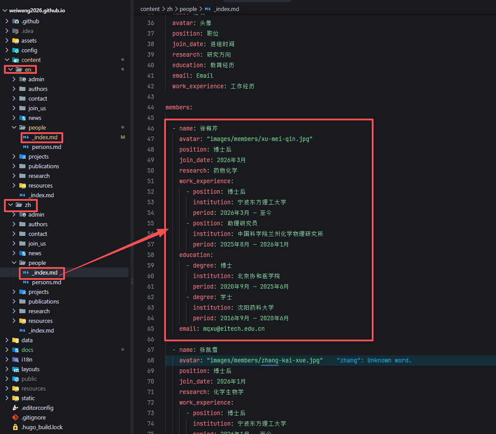
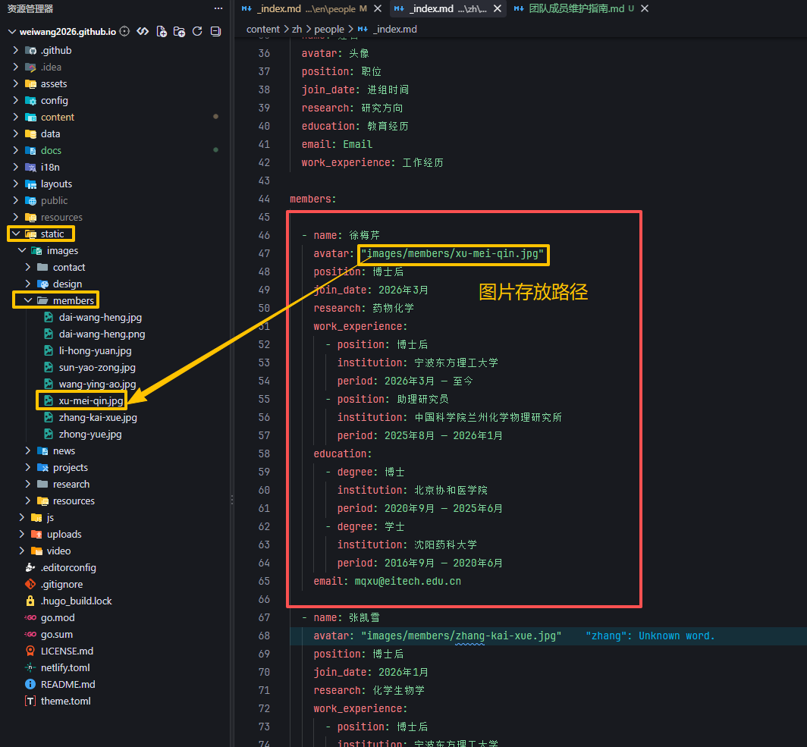
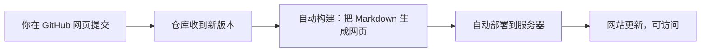
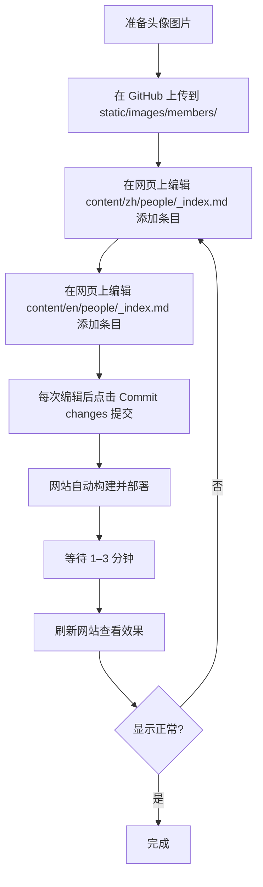

# 团队成员（Members）维护指南

本指南面向课题组网站维护人员，说明如何在网站上 **新增 / 修改 / 删除** 团队成员信息，并包含 GitHub 基本操作与 YAML 格式规范说明。

---

## 一、总览

网站上「团队成员」页面（中英文各一份）的数据来源是两个文件：

| 语言 | 文件路径 |
|------|----------|
| 中文 | `content/zh/people/_index.md` |
| 英文 | `content/en/people/_index.md` |

成员头像图片放在：

```
static/images/members/
```

页面最终展示效果依赖文件顶部的 YAML front matter（前后两个 `---` 之间的内容），我们只需要修改 `members:` 下面这一块即可。

> ⚠️ 重要：**中文和英文文件是各自独立的**，新增成员时通常两个文件都要加，否则只会在一种语言下显示。





---

## 二、一个成员条目的结构

每个成员都是 `members:` 列表下的一个条目，以 `- name: 姓名` 开头。完整字段如下：

```yaml
  - name: 徐梅芹                          # 姓名（必填）
    avatar: "images/members/xu-mei-qin.jpg"  # 头像路径（相对于 static/）
    position: 博士后                      # 职位（必填）
    join_date: 2026年3月                  # 进组时间
    research: 药物化学                    # 研究方向
    work_experience:                     # 工作经历（可为 null）
      - position: 博士后
        institution: 宁波东方理工大学
        period: 2026年3月 — 至今
      - position: 助理研究员
        institution: 中国科学院兰州化学物理研究所
        period: 2025年8月 — 2026年1月
    education:                           # 教育经历
      - degree: 博士
        institution: 北京协和医学院
        period: 2020年9月 — 2025年6月
      - degree: 学士
        institution: 沈阳药科大学
        period: 2016年9月 — 2020年6月
    email: mqxu@eitech.edu.cn            # 邮箱
```

### 字段说明

| 字段 | 是否必填 | 说明 |
|------|:--------:|------|
| `name` | ✅ | 成员姓名 |
| `avatar` | ✅ | 头像路径，建议写成 `"images/members/文件名.jpg"` |
| `position` | ✅ | 职位，如 `博士后` / `科研助理` / `博士生` |
| `join_date` | 可选 | 进组时间 |
| `research` | 可选 | 研究方向 |
| `work_experience` | 可选 | 工作经历列表；没有就写 `null` |
| `education` | 可选 | 教育经历列表 |
| `email` | 可选 | 邮箱 |

---

## 三、新增成员（Add）

### 第 1 步：准备头像图片

1. 命名规则建议：`姓-名拼音.jpg`，例如 `zhang-san.jpg`（全部小写，用 `-` 连接）。
2. 把图片放到 `static/images/members/` 目录下。
3. 建议图片为正方形，尺寸约 400×400 像素，格式 `.jpg` 或 `.png`。

> 头像路径在文件里写的是 `images/members/xxx.jpg`，**不要**写 `static/`，因为 `static/` 是网站根目录。

### 第 2 步：在 YAML 中添加条目

在 `content/zh/people/_index.md` 中找到 `members:` 这一行，把新成员**追加到某个现有条目之后**（保持 `- name:` 开头，缩进两个空格）。

```yaml
  - name: 张三
    avatar: "images/members/zhang-san.jpg"
    position: 博士生
    join_date: 2026年9月
    research: 药物化学
    work_experience: null
    education:
      - degree: 硕士
        institution: 某某大学
        period: 2023年9月 — 2026年6月
      - degree: 学士
        institution: 某某大学
        period: 2019年9月 — 2023年6月
    email: zhangsan@eitech.edu.cn
```

### 第 3 步：同步英文文件

在 `content/en/people/_index.md` 中添加对应英文条目（内容结构完全一样，只是文字改为英文）：

```yaml
  - name: San Zhang
    avatar: "images/members/zhang-san.jpg"
    position: PhD Student
    join_date: September 2026
    research: Medicinal Chemistry
    work_experience: null
    education:
      - degree: Master
        institution: Some University
        period: Sep 2023 – Jun 2026
      - degree: Bachelor
        institution: Some University
        period: Sep 2019 – Jun 2023
    email: zhangsan@eitech.edu.cn
```

### 第 4 步：提交修改

按第七节「在 GitHub 网站上修改并提交」的方法，把中英文两个文件的改动提交即可。

---

## 四、修改成员信息（Edit）

1. 在 GitHub 网站上打开 `content/zh/people/_index.md`。
2. 按 `Ctrl + F` 搜索成员姓名（如 `徐梅芹`）。
3. 直接修改对应字段的值，例如把 `position: 博士后` 改成 `position: 副研究员`。
4. **英文文件做同样修改**。
5. 按第七节的方法提交。

> 修改时只改「冒号后面的值」，不要动字段名（如 `position:`）和缩进。

---

## 五、删除成员（Delete）

### 情况 A：成员离开课题组，但仍需在「Alumni / 校友」中保留

1. 找到该成员的完整条目（从 `  - name:` 到下一个 `  - name:` 之前）。
2. 把 `position` 改为对应的校友分类（如 `Alumni`），或按网站分类要求调整。

### 情况 B：完全删除

1. 在 `content/zh/people/_index.md` 中选中该成员**整个条目**（含 `- name:` 到最后一个字段，且不要多选或少选）。
2. 删除这段内容。
3. 英文文件 `content/en/people/_index.md` 同样删除。
4. （可选）删除 `static/images/members/` 下对应的头像图片。
5. 按第七节的方法提交。

> ⚠️ 删除时要连同该条目的所有子字段一起删掉，否则 YAML 会报错，页面可能无法生成。

---

## 六、YAML 格式规范（重点）

YAML 对**缩进和符号**极其敏感，90% 的报错都来自格式问题。

### 1. 只用空格，不要用 Tab

- 缩进统一用 **2 个空格**。
- 绝对不要使用 Tab 键缩进。
- 建议在 VS Code 中设置：右下角 `Spaces: 2`。

### 2. 层级缩进对应关系

```yaml
members:              # 顶层，0 空格

  - name: 张三        # 列表项，2 空格 + "- "
    avatar: "..."     # 同一成员的字段，4 空格
    education:        # 子列表标题，4 空格
      - degree: 硕士   # 子列表项，6 空格 + "- "
        institution: 某某大学   # 子字段，8 空格
```

记忆口诀：
- 每个成员以 `  - name:`（2 空格 + `- `）开头；
- 该成员的其他字段用 4 空格对齐；
- `education` / `work_experience` 下面的 `- degree:` / `- position:` 用 6 空格；
- 再下一层（`institution`、`period`）用 8 空格。

### 3. 冒号后面要有空格

- ✅ `name: 张三`
- ❌ `name:张三`

### 4. 含特殊字符的字符串要加引号

- 路径含 `/`、`.` 时建议加引号：`avatar: "images/members/zhang-san.jpg"`
- 值里含 `:`、`#`、`"` 等特殊字符时，必须用引号包裹。

### 5. 空值写 null

没有工作经历时：

```yaml
work_experience: null
```

不要留空、不要写 `~`（虽然 `~` 也合法，但项目统一用 `null`）。

### 6. 列表项符号统一

- 使用 `- `（短横线 + 一个空格），不要用 `*` 或 `+`。

### 7. 常见错误对照

| 错误 | 现象 | 修正 |
|------|------|------|
| 用了 Tab 缩进 | 页面报错 / 成员不显示 | 改成 2 空格 |
| 缩进层级不一致 | 字段丢失或报错 | 严格按 2/4/6/8 空格 |
| 冒号后没空格 | 值被当作 key | 加空格 |
| 漏掉 `- ` 短横线 | 列表变成对象 | 补上 `- ` |
| 引号不配对 | 解析失败 | 检查 `"` 成对 |
| 中文冒号 `：` | 解析失败 | 用英文冒号 `:` |

---

## 七、在 GitHub 网站上修改并提交

网站内容托管在 GitHub 仓库，**所有操作都可以在浏览器里完成，不需要安装任何软件**。每次提交后，网站会自动重新构建并部署。

### 1. 打开仓库与文件

1. 登录 GitHub，打开本网站的仓库页面。
2. 依次点击进入 `content` → `zh`（或 `en`）→ `people` 文件夹。
3. 点击 `_index.md` 文件，即可看到内容。

### 2. 进入编辑模式

点击文件右上角的**铅笔图标 ✏️**（Edit this file），页面会变成一个可编辑的文本框。

> 若看不到铅笔图标，说明当前账号没有编辑权限，需要联系管理员开通。

### 3. 修改内容

在文本框里找到要改的位置，按第三～五节的方法增删改成员条目。

- 只改文字内容，**不要动缩进和字段名**；
- 中英文两个文件都要分别打开修改。

### 4. 提交（Commit）

1. 编辑完成后，点击页面右上角绿色的 **Commit changes…** 按钮。
2. 在弹出的窗口里填写一句简短的说明，例如：
   - `新增成员：张三`
   - `修改成员信息：徐梅芹职位`
   - `删除成员：某某`
3. 选择 **Commit directly to the `main` branch**（直接提交到主分支）。
4. 点击 **Commit changes** 确认提交。

> 提交 = 保存到仓库。提交后你的修改就正式记录在网站里了。

### 5. 网站自动构建与部署

提交完成后，网站会自动完成下面这套流程，**不需要人工干预**：



- **构建**：系统读取 `content/` 里的 Markdown/YAML，生成 HTML 网页；
- **部署**：把生成的网页发布到线上服务器；
- **时间**：通常需要 **1–3 分钟**，稍等后刷新网站页面即可看到效果。

### 6. 上传头像图片

1. 在仓库页面进入 `static` → `images` → `members` 文件夹。
2. 点击右上角 **Add file** → **Upload files**。
3. 把准备好的头像图片拖入或选择上传。
4. 页面下方填写说明（如 `新增头像：zhang-san.jpg`），点击 **Commit changes**。

> 上传后图片路径就是 `images/members/文件名`，与 YAML 里 `avatar` 字段对应。

### 7. 查看修改历史 / 撤销错误

- 点击文件右上角的 **History** 可以查看这个文件的所有历史版本；
- 如果改错了，可以打开某个历史版本，重新复制回正确内容再提交一次；
- 也可以在提交记录里找到对应 commit，请管理员帮忙回滚。

---

## 八、完整操作流程示例（新增一名成员）



---

## 九、常见问题 FAQ

**Q1：加完成员页面没变化？**
- 确认已经在 GitHub 上点击了 **Commit changes**；
- 等待 1–3 分钟让网站自动重新构建；
- 刷新页面（可按 `Ctrl + F5` 强制刷新）。

**Q2：页面报错 / 成员不显示？**
- 多半是 YAML 缩进或冒号问题，按第六节逐项检查；
- 打开文件 History 对比历史版本，看是否有误删或错位。

**Q3：只有中文页面显示，英文页面没有？**
- 因为两个文件是独立的，需要在 `content/en/people/_index.md` 里也添加。

**Q4：头像显示不出来？**
- 确认图片已放到 `static/images/members/`；
- 确认 `avatar` 路径写的是 `images/members/xxx.jpg`（不含 `static/`）；
- 确认文件名大小写完全一致（Linux 服务器区分大小写）。

**Q5：如何撤销一次错误修改？**
- 打开对应文件的 **History**，找到改动前的版本；
- 把正确内容复制回来，重新提交一次即可；
- 或联系管理员在后台回滚。

---

## 十、注意事项小结

1. **中英文两个文件都要改**（除特殊情况）。
2. **缩进只用 2 个空格**，禁止 Tab。
3. **只改冒号后面的值**，字段名和层级不要动。
4. 所有操作都在 GitHub 网页完成，改完点击 **Commit changes** 提交。
5. 图片上传到 `static/images/members/`，路径写 `images/members/xxx.jpg`。
6. 提交说明写清楚做了什么，方便日后查找。
